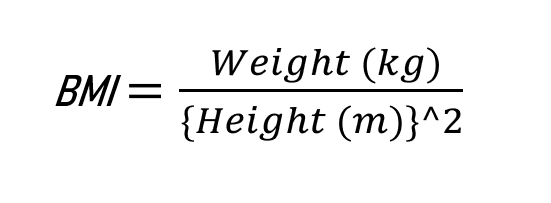

# BMI calculator

### This repository describes a terminal based BMI calculator using Python Programming Language

<h1>  </h1>

## What is BMI?

<h1 align="center">  </h1>

Body mass index is a value derived from the mass and height of a person. The BMI is defined as the body mass divided by the square of the body height, and is expressed in units of kg/m², resulting from mass in kilograms and height in metres.

For more information on BMI [visit this link](https://en.wikipedia.org/wiki/Body_mass_index).

### Procedure to clone project

- Open your terminal
- Type git clone https://github.com/daveeazi/bmi-calculator.git
- Type cd bmi-calculator to change directory to the folder of the project
- Run the project in your local machine

### Project link

https://daveeazi.github.io/bmi-calculator/

### 👤 **Author**

- [GitHub](https://github.com/daveeazi)
- [Twitter](https://twitter.com/iamdaveeazi)
- [LinkedIn](https://www.linkedin.com/in/david-atat/)

### Contributing

Contributions, issues, and feature requests are welcomed!

### Show your support

Give a ⭐️ if you like this project!
